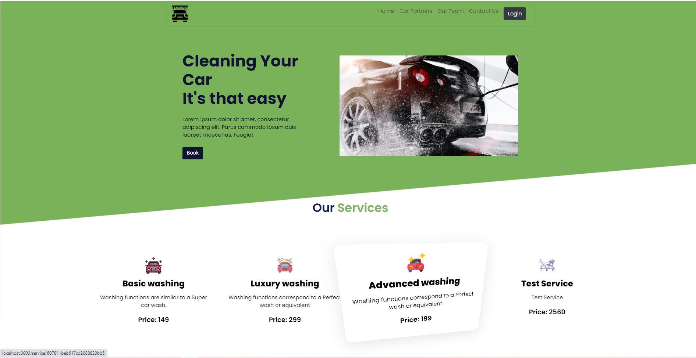
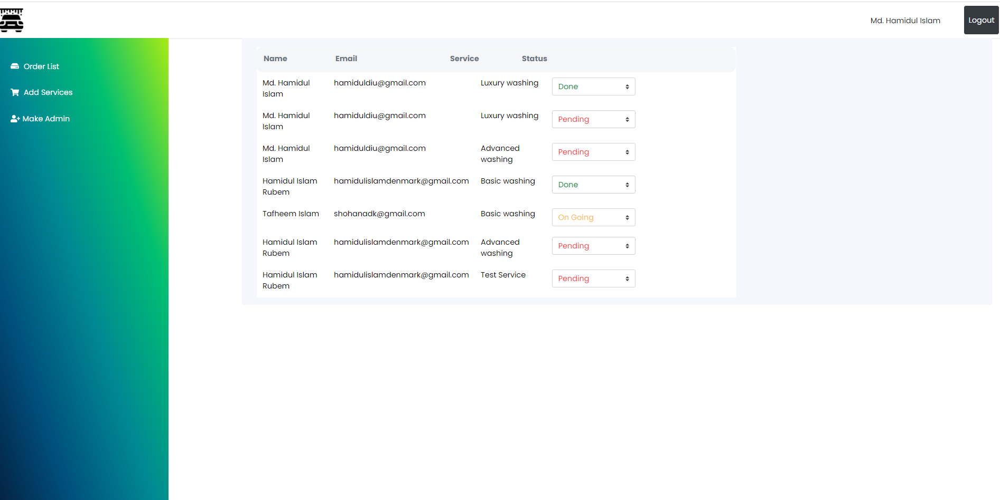

# Project: Car Washing app.
[Live Website](https://hero-fullstack.web.app/) | [Live API Server](https://young-sierra-54115.herokuapp.com/)
## Feature

- Responsive MERN Stack project with firebase authentication, admin authentication, persistent login and dashboard functionality for customer and admin
- Customer have ability to register in available services, check status of service(s) registered, and provide feedback
- Only admin can update the customer service status from pending to on going to done, add new service with image and add new admin.
- Customer need to click on service image card to register in specific service.
- Sign in is required to register in any service or to view Customer dashboard with services status.
- Logged in user will see a button named "Dashboard", where they can view the services they registered.

Note: Only admin user have ability to view admin dashboard.

## Technology

- React JS
- Firebase Authentication (Google)
- React Router, Private Router
- React Hook Form
- React Context API
- React Hook
- Firebase Hosting
- React Spring
- React Alice Carousel
- Bootstrap
- CSS3
## Back-end Technology

- Node JS
- Express JS
- Express file upload
- Mongodb
- Heroku
- Cors
- Body parser
- Dotenv
- nodemon

<h2>Project screenshot</h2>

 
